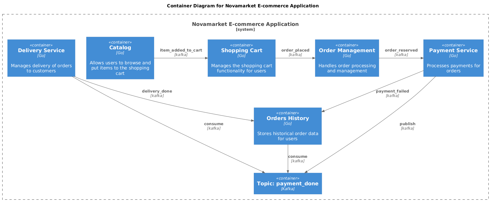

### **Название задачи:** Добавление истории заказов
### **Автор:** Егоров Антон
### **Дата:** 08.12.2025
### **Функциональные требования**

После завершения доставки покупатель может вернуться в свой личный кабинет и увидеть историю всех покупок:
- В списке отображаются все заказы: когда они были сделаны, сколько стоили, каким способом доставлены.
- Для каждого заказа можно открыть подробную информацию: список товаров, их количество и цену, итоговую сумму, способ доставки и оплаты, финальный статус заказа (доставлен, отменён).
- Покупатель может скачать чек, оставить отзыв о товаре или заказать его снова.

|**№**|**Действующие лица или системы**|**Use Case**|**Описание**|
| :-: | :- | :- | :- |
| 1 | Пользователь, Сервис истории заказов | Просмотр истории всех заказов | 1. Пользователь открывает личный кабинет 2. В истории заказов отображается полная информация обо всех заказах, включая отменённые, или в процессе |
| 2 | Пользователь, Сервис истории заказов | Запрос чека | 1. Пользователь открывает личный кабинет 2. В истории заказов отображается полная информация обо всех заказах, включая отменённые, или в процессе 3. Пользователь заказывает чек по выбранному заказу |

### **Нефункциональные требования**

- Время отклика сервиса истории заказов не должно превышать 1 секунды (95-й перцентиль)

### **Решение**

Ниже приведена контейнерная диаграмма C4, иллюстрирующая архитектуру решения для добавления истории заказов.

Было принято решение добавить новый сервис с минимальной доработкой остальных компонентов системы. Новый сервис будет подписан на существующее событие "payment_done", которое публикуется сервисом оплаты после успешного завершения платежа. При получении этого события сервис истории заказов будет сохранять информацию о заказе в свою базу данных.

Помимо этого, сервис истории заказов будет также подписан на событие "delivery_done", публикуемое сервисом доставки после успешного завершения доставки заказа. Это позволит сервису истории заказов обновлять статус заказа в своей базе данных.

Также, сервис истории заказов подписан на событие "payment_failed", чтобы иметь возможность отмечать заказы как отменённые в случае неудачного платежа.

При разработке нового сервиса надо будет учесть вопросы безопасности (например, сервис не должен предоставлять доступ к истории заказов другим пользователям).

### **Альтернативы**

- Возможен вариант внедрения единого оркестратора для управления всеми этапами заказа, включая историю заказов, однако это потребует большого количества ресурсов и изменений в существующей архитектуре. Было принято решение добавить новый сервис с минимальной доработкой остальных компонентов системы.

**Недостатки, ограничения, риски**

- Увеличение количества сервисов в системе приведёт к росту сложности поддержки и мониторинга.
